# CE2COAST — ML Bias Correction Pipeline

**Physics-grounded machine learning correction of North Sea ROMS model outputs (SST and Chlorophyll-a), with optimal interpolation data assimilation and uncertainty quantification.**

*Eugène Ivanov — MAST, University of Liège*

---

## Overview

CE2COAST is a regional ocean model (ROMS) running North Sea simulations under the SSP3-7.0 climate scenario (MAR v3.14 / MPI-ESM forcing, 1980–2100). Despite capturing dominant physical dynamics, the model exhibits systematic seasonal biases in sea surface temperature and chlorophyll concentration.

This pipeline builds a three-layer correction system:

```
ROMS raw output
      ↓
XGBoost residual correction    (removes systematic seasonal + state-dependent bias)
      ↓
Optimal Interpolation update   (assimilates sparse in-situ observations)
      ↓
Analysis field with uncertainty bounds
```

---

## Key Results

| Variable | Metric | ROMS raw | XGB corrected | Improvement |
|---|---|---|---|---|
| SST | RMSE (°C) | 1.949 | 0.731 | −63% |
| SST | R² | 0.71 | 0.96 | +35% |
| SST | Bias (°C) | −0.47 | +0.02 | −96% |
| Chl | RMSE (mg/m³) | 2.952 | 0.913 | −69% |
| Chl | R² | −2.45 | 0.67 | +3.12 |

---

## Results

### SST bias correction diagnostics

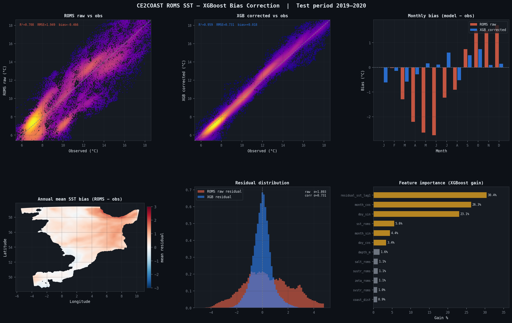

*Left to right: scatter obs vs ROMS raw, scatter obs vs XGB corrected, monthly bias before/after, spatial bias map, residual histogram, feature importance. RMSE 1.95→0.73°C, R² 0.71→0.96.*

---

### Chlorophyll bias correction diagnostics

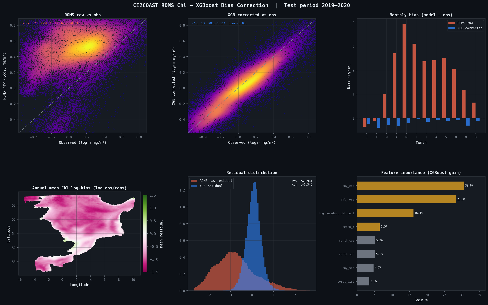

*Raw ROMS R²=−2.45 (worse than climatology). XGB corrected R²=0.67. Spring bloom overestimation (Apr–May +4 mg/m³) nearly eliminated.*

---

### Ablation study — seasonal vs physics contributions

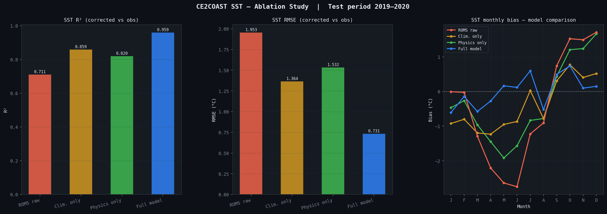

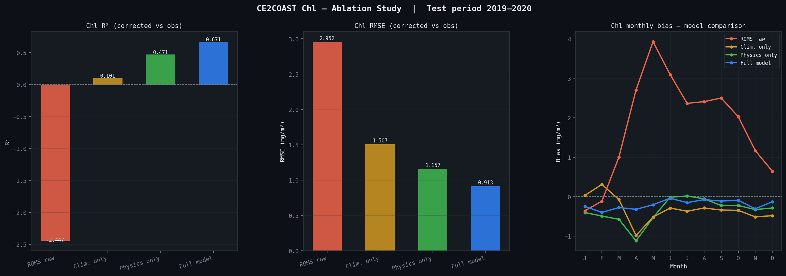

*SST: climatology and physics features contribute roughly equally. Chl: physics features dominate with ΔR²=+0.57 beyond pure seasonality — bloom correction requires knowing the physical state, not just the date.*

---

### Seasonal error maps

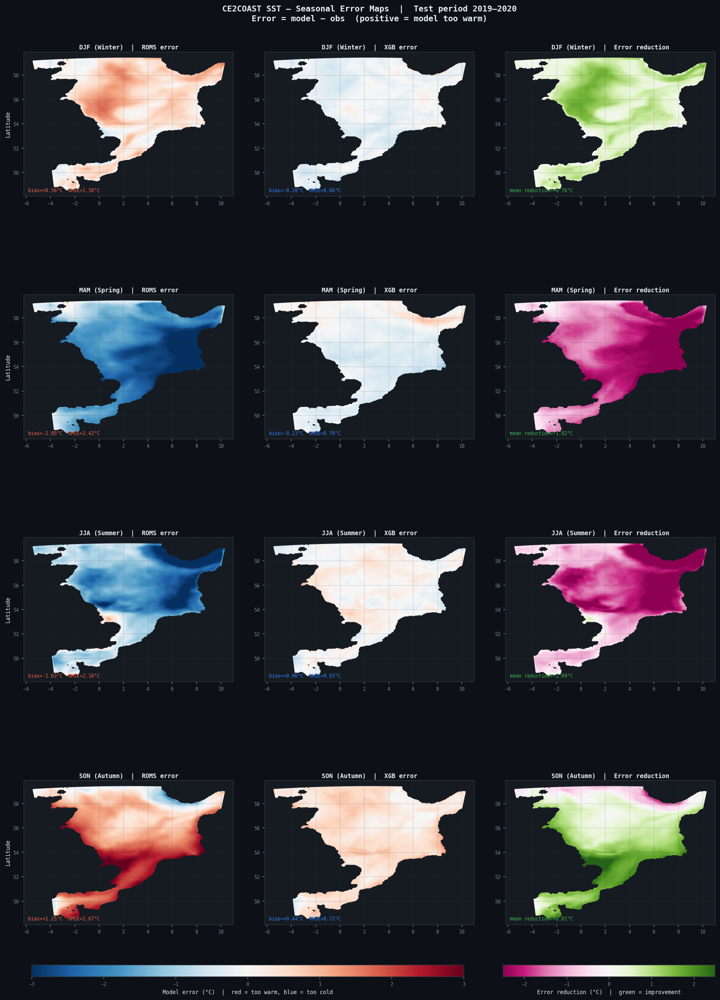

*4×3 grid: ROMS error | XGB error | error reduction per season. Spring RMSE reduction 1.72°C — largest of any season, driven by thermocline onset timing.*

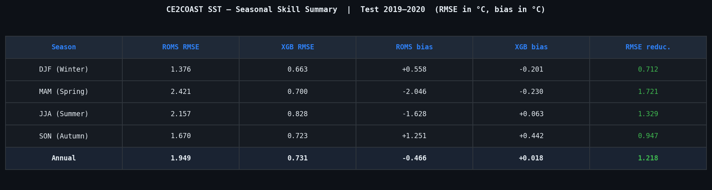

---

### Three-layer correction maps

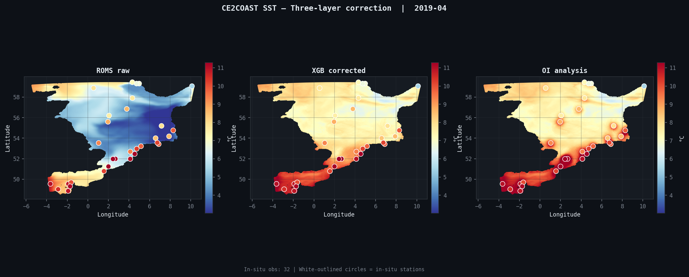

*Spring 2019 (most anomalous month, anom=0.80). ROMS raw → XGB corrected → OI analysis incorporating 29 in-situ stations.*

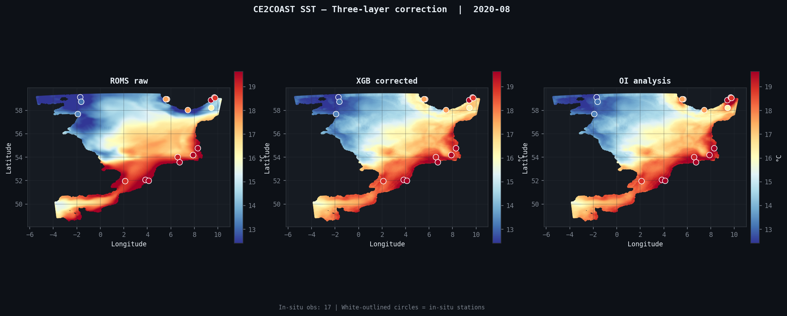

*Summer 2020. OI update shows localised warm corrections near coastal stations — physically consistent with shallow-water summer SST.*

---

### Uncertainty quantification

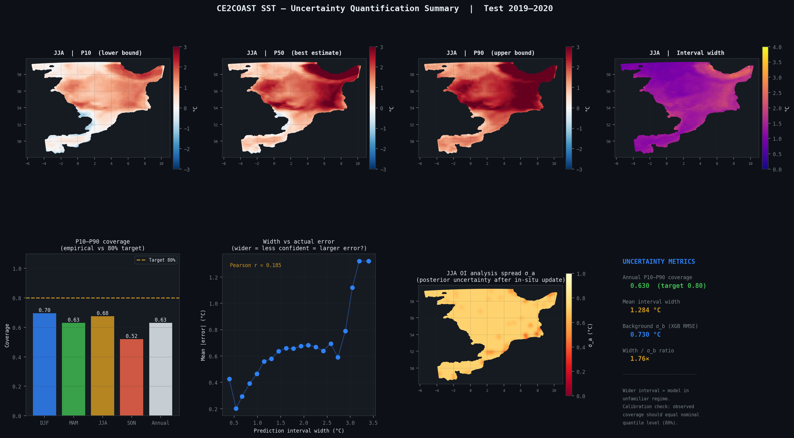

*Top row: JJA P10/P50/P90 spatial maps + interval width. Bottom: seasonal coverage (63% annual vs 80% target — model overconfident), width-vs-error calibration (r=0.185), OI posterior spread σ_a.*

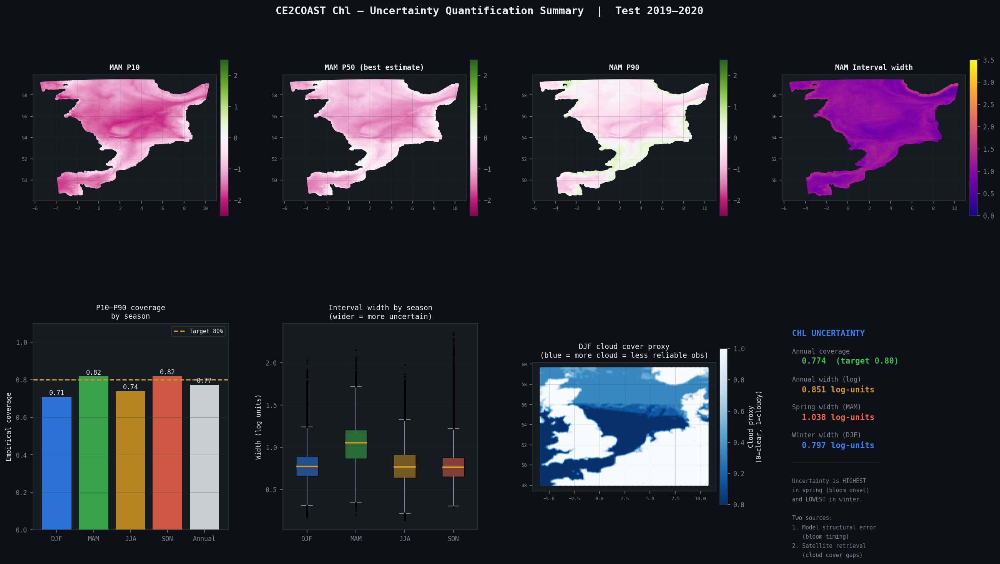

*Spring Chl uncertainty dominated by bloom timing (model structural), winter by cloud cover (satellite retrieval). Two sources independently identifiable from the data.*

---

### Anomaly detection

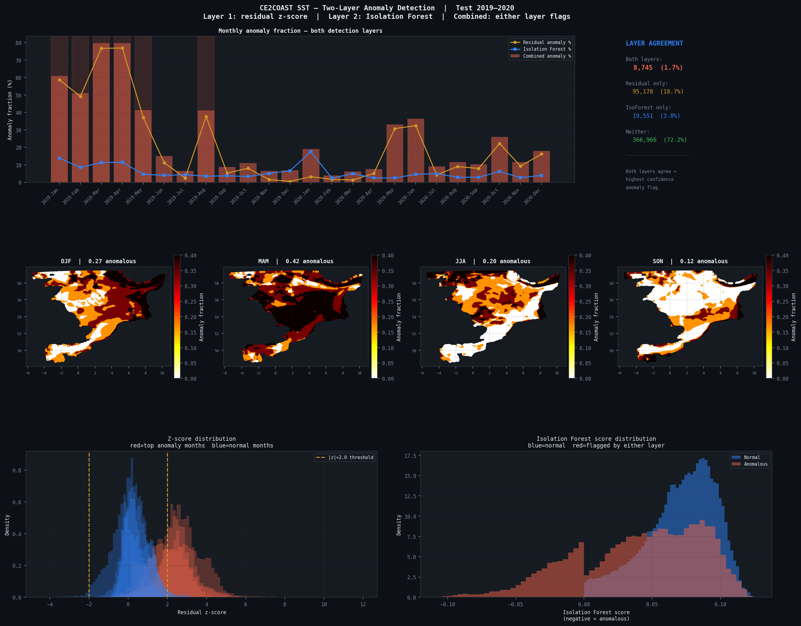

*Two-layer anomaly detection timeline, seasonal spatial maps, and score distributions. 2019-Mar/Apr most anomalous (anom=0.80) — consistent with 2019 European spring heatwave. 72% of observations in normal regime.*

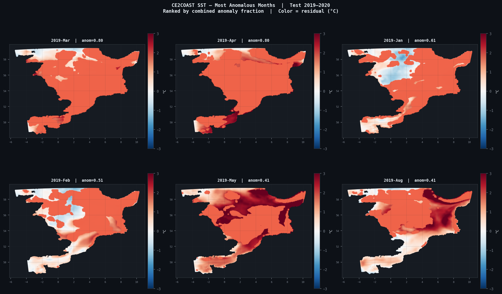

*Six most anomalous months ranked by combined detection fraction. All from 2019 — confirms 2020 within model's learned range despite COVID atmospheric changes.*

---

## Pipeline

```
extract_colloc_roms.py    — ROMS x satellite collocation (KDTree / RegularGridInterpolator)
build_features_roms.py    — Feature engineering (depth, coast dist, doy cycle, lag residual)
train_xgboost_roms.py     — XGBoost quantile + point models, gain importance
ablation_baseline.py      — Climatology-only vs physics-only vs full model
ingest_insitu_bgc.py      — CMEMS in-situ BGC profile ingestion (monthly resampling)
kalman_update_roms.py     — Optimal Interpolation: x_a = x_b + K(y - Hx_b)
visualise_results_roms.py — Scatter, monthly bias, spatial maps, feature importance
seasonal_error_maps.py    — Seasonal error decomposition + OI increment maps
uncertainty_sst.py        — Quantile regression P10/P50/P90 + OI spread (SST)
uncertainty_chl.py        — Quantile regression + cloud cover proxy (Chl)
anomaly_detection.py      — Residual z-score + Isolation Forest anomaly detection
ce2coast_config.py        — Shared path configuration (env-var based)
```

---

## Setup

### 1. Environment variables

```bash
cp .env.example .env
# Edit .env with your data paths
source .env
```

| Variable | Description |
|---|---|
| `CE2COAST_BASE` | Root data directory |
| `CE2COAST_COLLOC` | ML collocation outputs |
| `CE2COAST_ROMS` | ROMS AVG NetCDF files |
| `CE2COAST_VALID` | Satellite validation data |
| `CE2COAST_INSITU` | In-situ BGC profiles |

### 2. Dependencies

```bash
pip install -r requirements.txt
```

Tested with Python 3.10, XGBoost 2.0, scikit-learn 1.3 on NIC5/CECI HPC (conda env Yoda).

### 3. Verify config

```bash
python ce2coast_config.py
```

### 4. Run full pipeline

```bash
bash run_pipeline.sh

# Resume from a specific step
bash run_pipeline.sh --from 7
```

---

## Data

### ROMS outputs
CE2COAST monthly AVG files (`Hindcast_CE2COAST_AVG_{year}_2c_atm3.nc`), 2010–2020.
Grid: 240x180 rho-points, 30 vertical levels, DT=300s.
Forcing: MAR v3.14-ecRad / MPI-ESM SSP3-7.0.

### Satellite observations
- **SST**: CMEMS OSTIA L4 reprocessed daily (1/20 degree), resampled to monthly
- **Chl**: CMEMS `cmems_obs-oc_glo_bgc-plankton_my_l4-multi-4km_P1M`, monthly L4

### In-situ BGC
- CMEMS `INSITU_GLO_PHYBGCWAV_DISCRETE_MYNRT_013_030`
- 1182 platform files (Argo, CTD, Ferrybox), North Sea 48-62N
- 2,867 monthly surface temperature obs, 223 monthly surface Chl obs

---

## Methods

### Collocation
ROMS (curvilinear, ~15km) collocated against satellite (regular, 4km) via `RegularGridInterpolator` — obs grid interpolated onto ROMS rho-points. In-situ matched via `cKDTree` nearest-neighbour (threshold 0.2 degrees).

### XGBoost residual correction
Target: `residual = obs - ROMS`. Features: ROMS physical state, bathymetry, coast distance, cyclical season encoding, lagged residual. Train: 2010-2018. Test: 2019-2020 (strict temporal holdout).

### Optimal Interpolation
`x_a = x_b + K(y - Hx_b)`, `K = BHt(HBHt + R)^-1`
Gaussian covariance, `L_b=0.3 degrees`, sigma_b from XGB RMSE, sigma_o=0.3 degC.

### Uncertainty quantification
XGBoost `reg:quantileerror` for P10/P50/P90. OI posterior spread from analysis error covariance. Chl cloud proxy from NaN fraction in monthly satellite composites.

### Anomaly detection
Residual z-score vs 2010-2018 climatology (flag |z|>2) combined with Isolation Forest on physical feature matrix (contamination=5%).

---

## Scientific context

| Season | ROMS SST error | Physical cause | XGB RMSE reduction |
|---|---|---|---|
| MAM | -2.05C cold | Spring thermocline onset too late | 1.72C |
| JJA | -1.63C cold | Summer stratification underestimated | 1.33C |
| SON | +1.25C warm | Mixed layer deepening too slow | 0.95C |
| DJF | +0.56C warm | Winter convection overestimated | 0.71C |

Chl: ROMS/FABM overestimates spring bloom by ~2.5x. Physics features dominate correction (delta R2=+0.57 beyond pure seasonality).

---

## Repository structure

```
.
├── ce2coast_config.py
├── extract_colloc_roms.py
├── build_features_roms.py
├── train_xgboost_roms.py
├── ablation_baseline.py
├── ingest_insitu_bgc.py
├── kalman_update_roms.py
├── visualise_results_roms.py
├── seasonal_error_maps.py
├── uncertainty_sst.py
├── uncertainty_chl.py
├── anomaly_detection.py
├── run_pipeline.sh
├── figures/
├── requirements.txt
├── .env.example
└── README.md
```

---

## License

MIT License. Data derived from Copernicus Marine Service — see [marine.copernicus.eu](https://marine.copernicus.eu) for attribution requirements.
